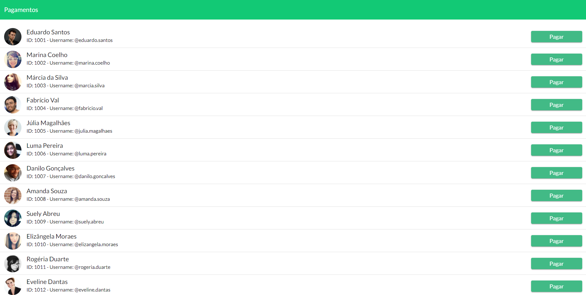
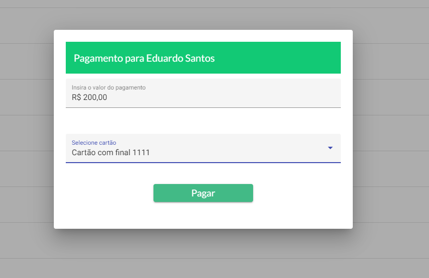
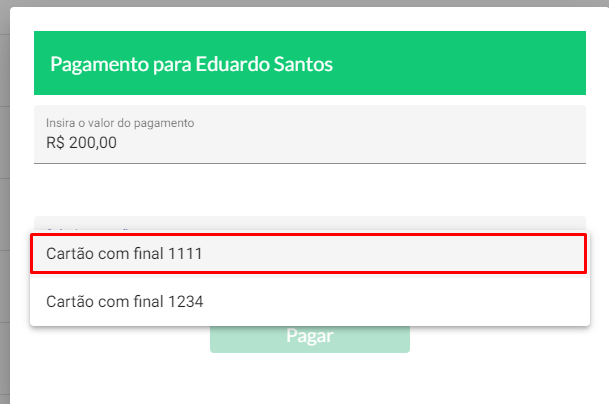
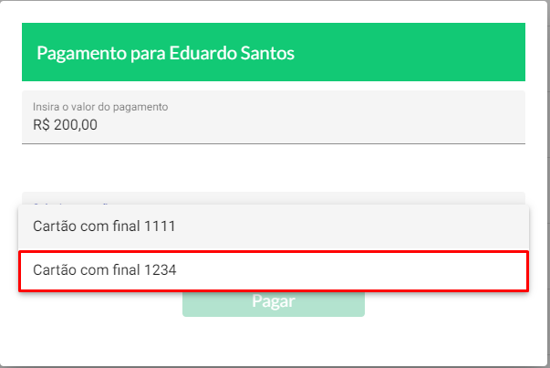
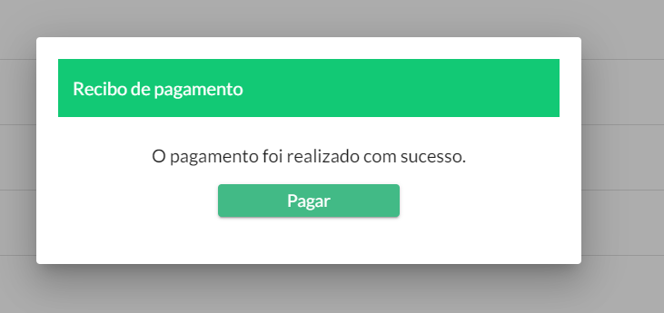
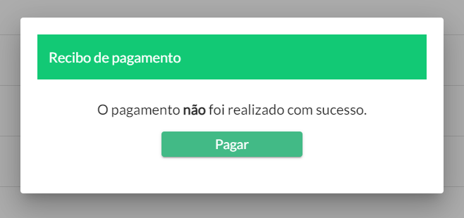

# PICPAY-DESAFIO-FRONTEND
> Aplicação do desafio frontend proposto pelo PICPAY

**Git clone**

```sh
git clone https://github.com/mathosmor/picpay-desafio-frontend.git
```

**Instalação de dependências:**

```sh
npm install
```

***

## Funcionamento da aplição
> Resumo de funcionamento da aplicação

Na **tela inicial de pagamentos**, você deve escolher um **"usuário"** e clicar em **"Pagar"**;



Na **tela de selecionar valor e cartão de crédito**, você deve inserir um **valor númerico** no valor R$ a ser transferido e selecionar um **"cartão de crédito"**



Atualmente temos 2 cartões de crédito:

* Cartão válido
    

* Cartão inválido
    

Na **tela status pagamento**, você receberá uma resposta dizendo se o pagamento foi **realizado com sucesso** ou se o **pagamento não realizado com sucesso**

Mensages de resposta:

* Cartão válido
    

* Cartão inválido
    

***